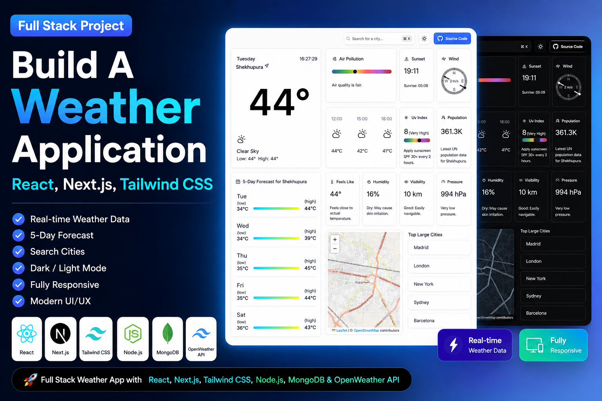

# 🌦️ Weather Application

A modern **Full Stack Weather Application** built with **Next.js, React, Tailwind CSS, OpenWeather API, Leaflet Maps, and OpenStreetMap**. Search any city worldwide and get real-time weather, forecasts, air quality, UV index, wind details, sunrise/sunset, interactive maps, and much more.



---

## ✨ Features

- 🌍 Search weather for any city
- 🌡️ Real-time weather information
- 📅 5-Day Weather Forecast
- 🕒 Live Clock & Current Day
- 🌅 Sunrise & Sunset Time
- 🌬️ Wind Speed & Direction
- 🌫️ Air Pollution Index (AQI)
- ☀️ UV Index
- 💧 Humidity
- 🌡️ Feels Like Temperature
- 👀 Visibility
- ⚡ Atmospheric Pressure
- 🗺️ Interactive Map (Leaflet + OpenStreetMap)
- 🌙 Dark / Light Theme
- 📱 Fully Responsive Design
- ⚡ Fast Performance using Next.js
- 🎨 Modern UI/UX

---

## 🛠️ Tech Stack

### Frontend

- Next.js
- React.js
- Tailwind CSS
- TypeScript

### APIs

- OpenWeather API
- OpenWeather Air Pollution API
- OpenWeather Forecast API
- OpenStreetMap
- Leaflet Maps

### Deployment

- Vercel

---

## 📸 Screenshots

### ☀️ Light Mode

> Add your screenshot here

```
public/screenshots/light-mode.png
```

---

### 🌙 Dark Mode

> Add your screenshot here

```
public/screenshots/dark-mode.png
```

---

## 📂 Folder Structure

```bash
Weather-Application/
│
├── app/
├── components/
├── lib/
├── public/
├── styles/
├── types/
├── utils/
├── .env.local
├── package.json
└── README.md
```

---

## ⚙️ Environment Variables

Create a **`.env.local`** file in the root directory.

```env
NEXT_PUBLIC_OPENWEATHER_API_KEY=YOUR_API_KEY
```

Get your free API key from:

https://openweathermap.org/api

---

## 🚀 Installation

Clone the repository

```bash
git clone https://github.com/ZainMurtaza3532/Weather-Application.git
```

Go to project folder

```bash
cd Weather-Application
```

Install dependencies

```bash
npm install
```

Run development server

```bash
npm run dev
```

Open

```
http://localhost:3000
```

---

## 📦 Build for Production

```bash
npm run build
```

Start Production Server

```bash
npm start
```

---

## 🌐 Live Demo

Coming Soon...

---

## 🎯 Future Improvements

- Weather Alerts
- Hourly Forecast
- Weather Radar
- Favorite Cities
- Geolocation Support
- Multi-language Support
- Weather Charts
- PWA Support
- Offline Mode
- AI Weather Insights

---

## 🤝 Contributing

Contributions are welcome!

1. Fork the project

2. Create your feature branch

```bash
git checkout -b feature/AmazingFeature
```

3. Commit your changes

```bash
git commit -m "Add Amazing Feature"
```

4. Push to the branch

```bash
git push origin feature/AmazingFeature
```

5. Open a Pull Request

---

## ⭐ Support

If you like this project, consider giving it a **⭐ Star** on GitHub.

---

## 👨‍💻 Author

**Zain Murtaza**

🌐 GitHub

https://github.com/ZainMurtaza3532

LinkedIn

https://www.linkedin.com/in/zainmurtaza3532/

Portfolio

https://zain-murtaza.vercel.app

---

## 📄 License

This project is licensed under the **MIT License**.

---

## ❤️ Made with

Next.js • React • Tailwind CSS • OpenWeather API